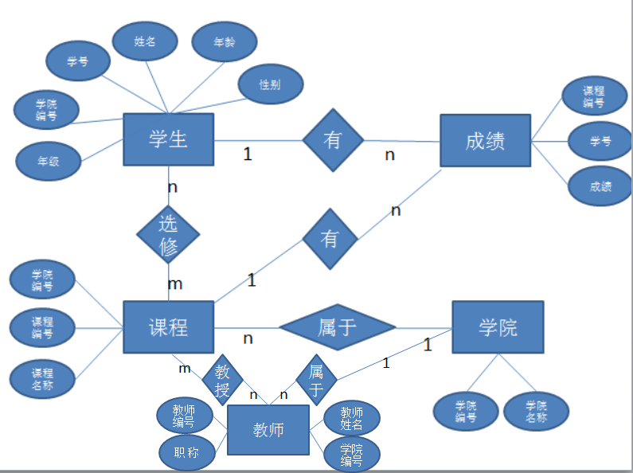

 # 需求分析 

   此次设计学生管理系统，需要对学生属于哪个学院，选修哪个学院的课程以及课程成绩进行管理。
   
 # 概念模型设计
 
     根据需求，将该系统的数据库分为4个基本关系，包括学生基本信息表（information）、课程基本信息表（course）、教师基本信息表（teacher）、学院基本信息表（scholl）、成绩基本信息表（score）；学生基本信息表中有学号，姓名，年龄，年级，学院编号，性别 6个属性，其中学号作为主键；课程基本信息表中包括课程编号、课程名称、学院编号 3个属性，其中课程编号作为主键，学院编号作为外键；教师基本信息表中有教师编号、教师姓名、职称及所属学院编号4个属性，其中教师编号作为主键，所属学院编号为外键；学院基本信息表中包括学院编号、学院名称 2个属性；成绩基本信息表中包括学号、课程编号、成绩 3个属性，其中学号和课程编号作为主键，同时也为外键。设计主要如下：
    
 ## school表的设计
 
   属性名 |数据类型 | 数据长度 |是否为主码 |是否能为空
   -------|-------|---------|---------|---------
   学院编号（sid）|char |10|是|否|
   学院名称（sname）|char |18|否|是|
 
  
## information表的设计
  属性名 | 数据类型 | 数据长度 | 是否为主码 | 是否为外码| 是否能为空|备注  
  ------|---------|---------|-----------|--------|-------- |------
  学    号（id）|char| 13 |是|否|否
  学院编号（sid) | char |10 |否|是|否
  姓    名（name）|char |10|否|否|是
  年    龄（age）|int|-|否|否|是|大于0下于150，默认为1
  年    级（grade）|int|-|否|否|是|值在1-6之间
  性    别（sex）|char|5|否|否|是|男或女，默认为空
  状    态（statu）|int|3|否|否|否|0或1，默认值为0；0表示该学生信息可见，1表示该学生信息不可见
  
  ## course表的设计
  
  属性名 | 数据类型 | 数据长度 | 是否为主码 | 是否为外码| 是否能为空|备注  
  ------|---------|---------|-----------|--------|--------|------- 
  课程编号（cid）|char| 10 |是|否|否
  学院编号（sid) | char |10 |否|是|否
  课程名字（cname）|char|20|否|否|否
  状   态（statu）|int|3|否|否|否|0或1，默认值为0；0表示该课程信息可见，1表示该课程星系不可见
  
   ## teacher表的设计
  
  属性名 | 数据类型 | 数据长度 | 是否为主码 | 是否为外码| 是否能为空|备注  
  ------|---------|---------|-----------|--------|--------|------- 
  教师编号（tid）|char| 10 |是|否|否
  教师姓名（tname) | char |10 |否|否|是
  职   称（rank）|char|10|否|否|否|值为讲师，教授，副教授；默认值为讲师
  状   态（statu）|int|3|否|否|否|0或1，默认值为0；0表示该学生信息可见，1表示该学生信息不可见课程名字（cname）|char|20|否|否|否
  
  ## score表的设计
  
  属性名 | 数据类型 | 数据长度 | 是否为主码 | 是否为外码| 是否能为空|备注
  ------|---------|---------|-----------|--------|--------|--------
  学   号（id）|char| 13|是|是|否
  课程编号（cid) | char |10 |是|是|否
  成绩（score）|int|-|否|否|是|大于等于0 小于等于150
 
  基于以上基本表的设计，得到如下图所示的E-R图：
   
 
 
 # 逻辑结构设计
 
   将概念结构设计好基本E-R图转换为与MYSQL数据库管理系统所支持的关系数据模型。
 > 关系模式如下
   (加粗的为主键，斜体为外键)
 >> 学生（** 学号 **，姓名，性别，年龄，_学院编号_）
   
 >> 课程（**课程编号**，课程名称，_所属学院编号_）
   
 >> 教师（**教师编号**，教师姓名，职称，_所属学院编号_）

 >> 学院 (**学院编号**，学院名称)
   
  >> 成绩 (_**学号**_，_**课程编号**_，成绩)
