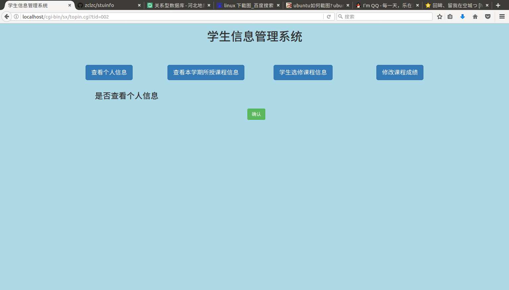
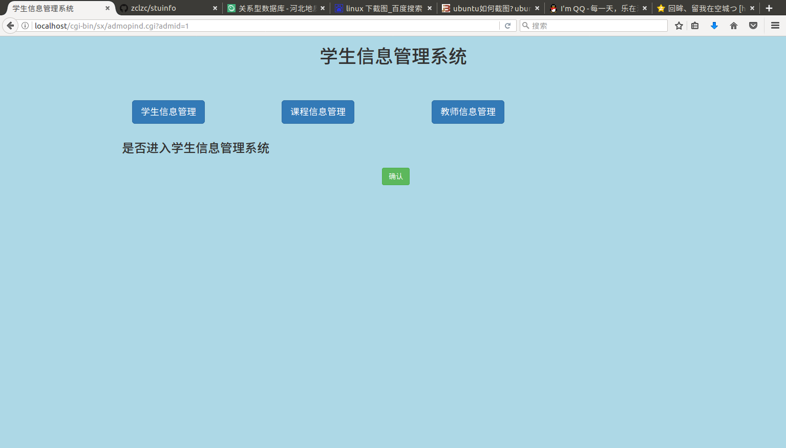

# 系统的实现
 
  在逻辑结构设计下运用MYSQL语句创建了 **stu**数据库，并建立相应的表；并根据系统功能的需求建立了相应的视图，从而使数据的存储方便。
  
## 功能及视图的说明
 
 **登录界面**
    

 
 **登录界面-student**

  学生登录模块的主要功能为查看所有课程信息、查看自己已选课程信息、添加选修课程、查看个人信息；建立视图情况如下：
 
### 学生功能与视图的建立

|功能模块|建立视图名称|视图基于的基本表|视图基于的其他视图|视图包含的属性
|-------|-----------|------------|-------------|---------------|
|查看所有课程信息|courseinfo|course teacher school|-|课程编号、课程名称、学分、授课教师、所属学院
|查看已选课程信息|sc| score |student courseinfo|学号、学生姓名、课程名称、课程所属学院、课程学分、成绩
|查看个人信息|student|information school|—|学号、姓名、性别、年龄、年级、学院
|添加选课信息|courseinfo sc|-|-|-|

 **登录界面-teacher**

  教师登录模块的主要功能为查看本学期所授课程信息、学生选修课程信息、修改课程成绩、查看个人信息；建立视图情况如下：
 
### 教师功能与视图的建立

|功能模块|建立视图名称|视图基于的基本表|视图基于的其他视图|视图包含的属性
|-------|-----------|------------|-------------|---------------|
|查看本学期所授课程信息|teacherinfo|course teacher|courseinfo |教师编号、课程编号、课程名称、学分、所属学院
|学生选修程信息|scft| course |sc|课程编号、学生学号、姓名、性别、年级、成绩、课程所属学院
|查看个人信息|teacherinfo|teacher school|—|教师编号、教师姓名、职称、所属学院
|修改课程成绩|scft|-|-|-|

**登录界面-adminer**

  管理员登录模块的主要功能为学生信息管理、教师信息管理、课程信息管理；其中每一个模块又分为查看全部信息、删除某个信息、和添加信息。

 
